# 24 — Diagrammes architecture, UML, séquence

> Tous les diagrammes utilisent la syntaxe **Mermaid**, rendue nativement par GitHub, GitLab, Notion, Obsidian et tout viewer Markdown moderne.

## 1. Vue d'ensemble — architecture C4 niveau Contexte

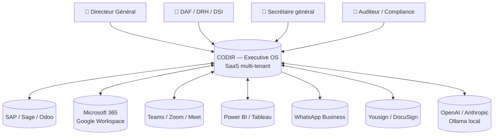

## 2. Architecture C4 niveau Conteneurs

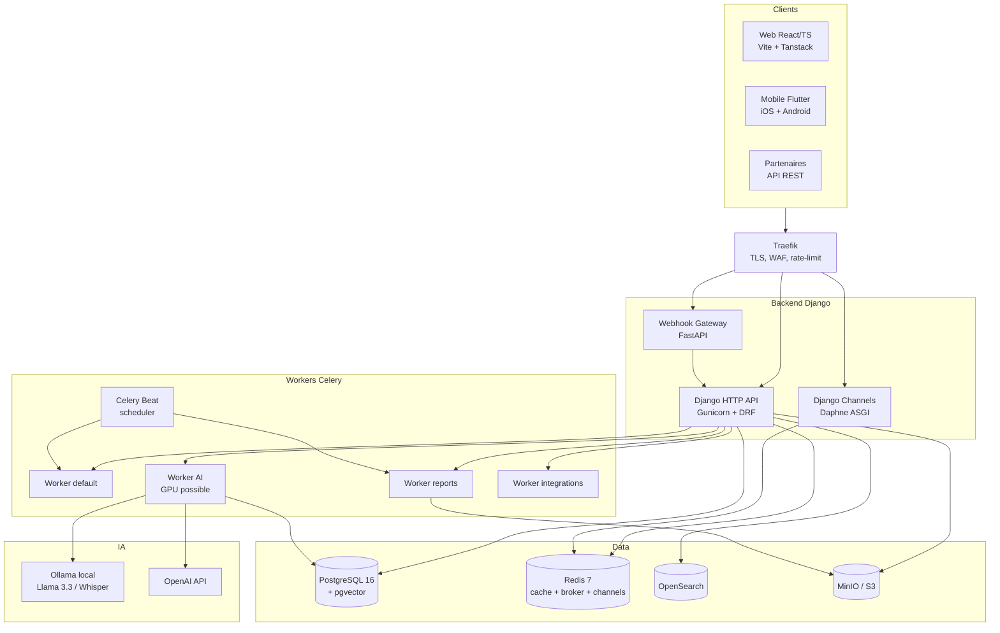

## 3. Modèle de données — vue partielle (Decision lifecycle)

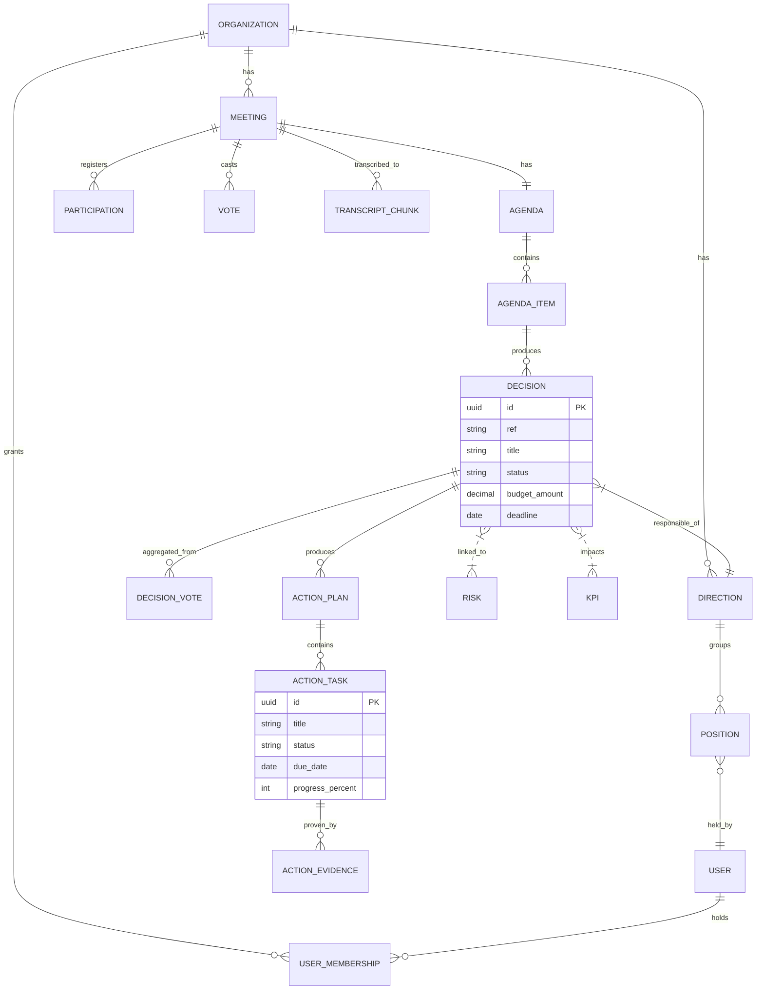

## 4. Séquence — Tenir une décision en réunion live

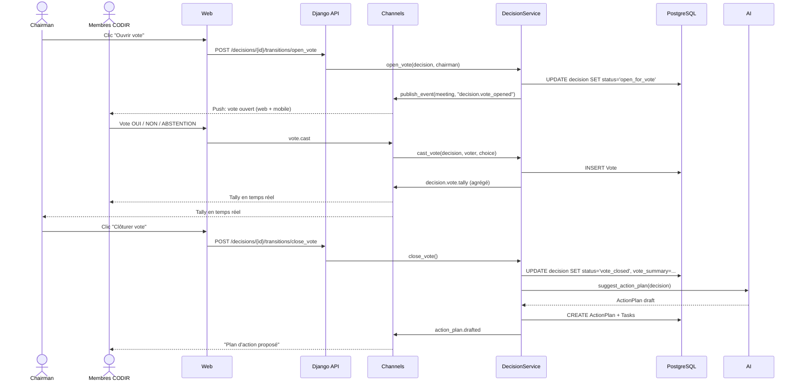

## 5. Séquence — Génération automatique du PV par IA

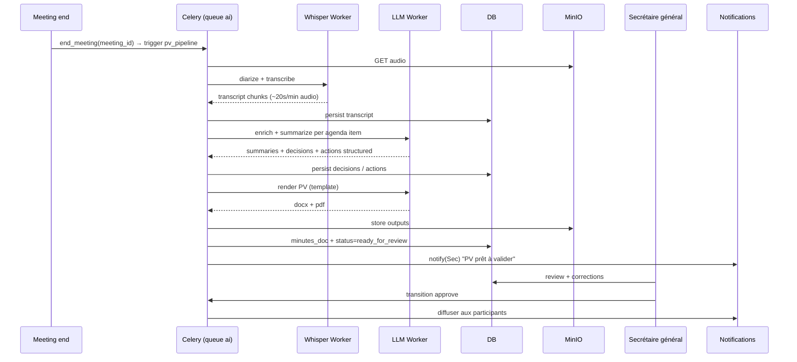

## 6. Séquence — Authentification SSO + MFA

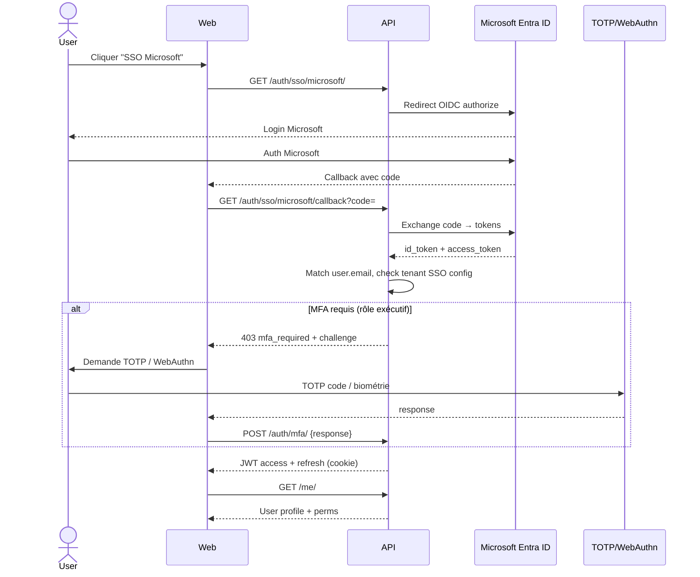

## 7. Séquence — Détection KPI breach + analyse IA

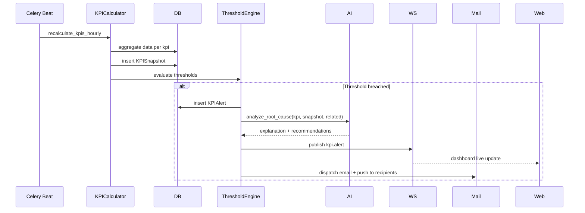

## 8. Diagramme de classes — Workflow engine

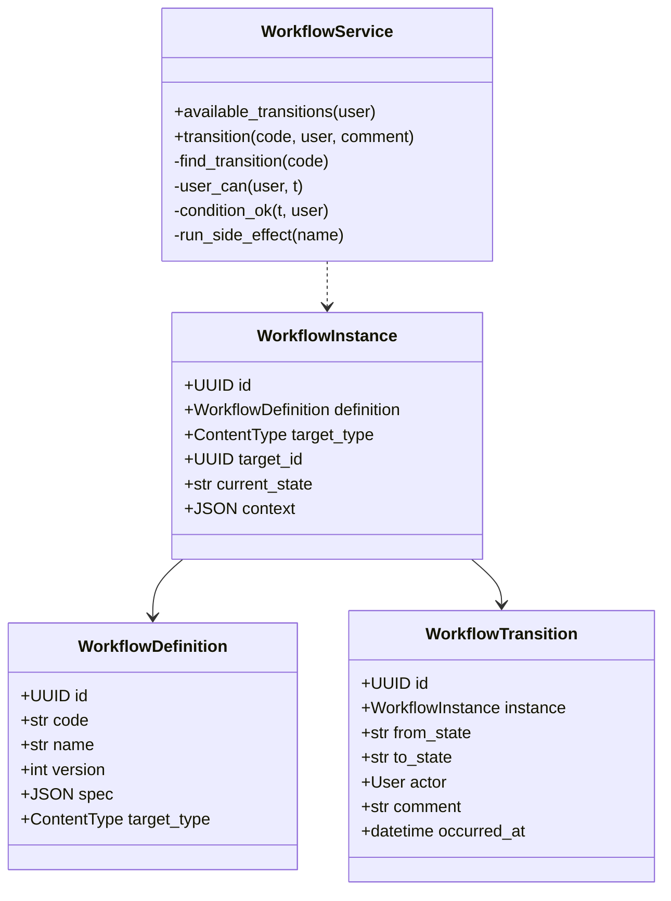

## 9. Cycle de vie d'une décision (machine d'état)

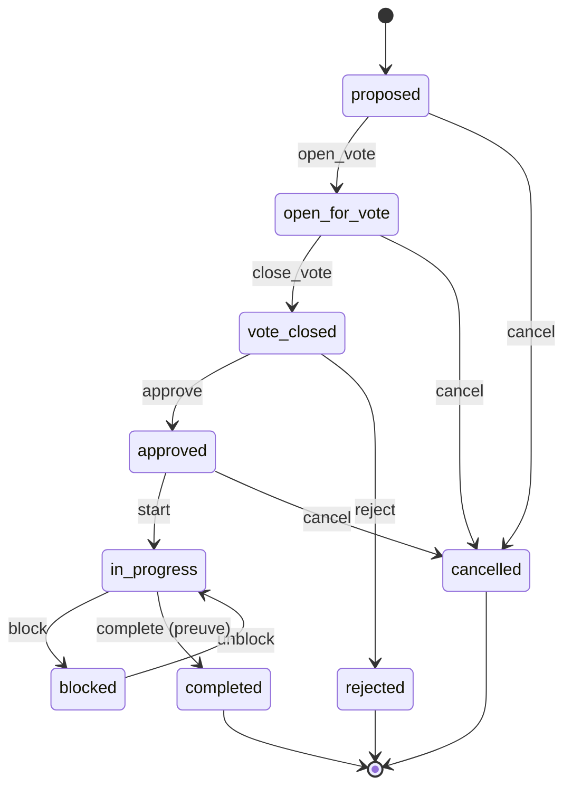

## 10. Architecture WebSocket

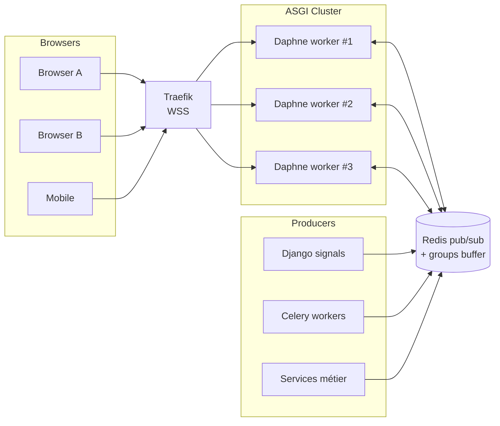

## 11. Pipeline IA (RAG + Copilot)

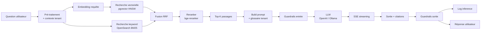

## 12. Topologie de déploiement Kubernetes

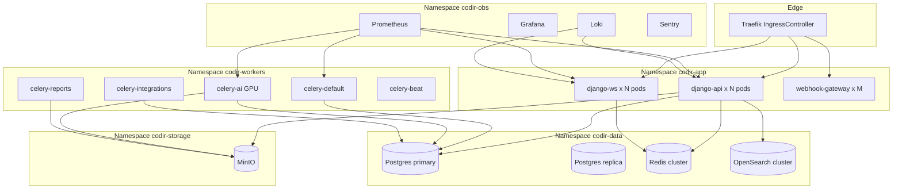

## 13. Gantt — Roadmap haut niveau

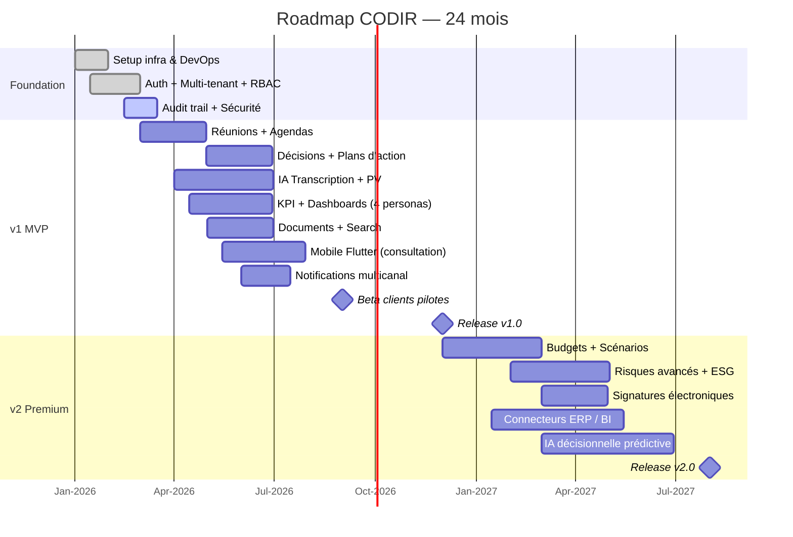

---

*Suite : [25 — Features premium](25_features_premium.md)*
